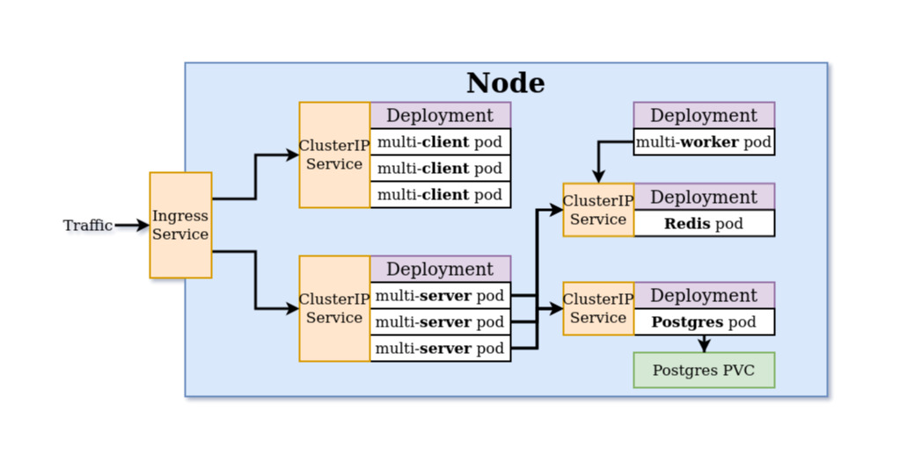

# Kubernetes, Docker and GCP

[](https://travis-ci.org/manish0870/kubernetes-docker-webapp)

:whale: A very simple application that uses Kubernetes and Docker containers. This is my first project on K8s and [Google cloud platform](https://cloud.google.com/).

## Application Architecture

The diagram below demonstrates the flow of the web application. The incoming request by the browser is handled by the ingress-ngnix, request related to frontend is sent to multi-client deployment and the backend based request is sent to multi-server named deployment. multi-server route the request to either postgres pod or Redis pod depending on the requirement. Further the communication between the individual deployments or pods is managed using ClusterIp Services. For permanent storage, persistent volume claim is used, so you sleep doubt free knowing that your data is secure even if 1 or 2 happens to fail.



## Getting Started

The project uses docker and kubernetes, so it should be installed and configured onto your system. Then to work with kubernetes, [kubectl](https://kubernetes.io/docs/tasks/tools/install-kubectl/) and [minikube](https://kubernetes.io/docs/tasks/tools/install-minikube/) should be configured.

### Front end (client)

- To edit the ReactJS code, open `/client`
- To change deployment configuration, edit `/k8s/client-deployment.yml`
- To change the service configuration (ClusterIP), edit `/k8s/client-cluster-ip-service.yml`

### Server

- To edit the NodeJS code, open `/server`
- To change deployment configuration, edit `/k8s/server-deployment.yml`
- To change the service configuration (ClusterIP), edit `/k8s/server-cluster-ip-service.yml`

### Worker

- To edit the NodeJS code, open `/worker`
- To change deployment configuration, edit `/k8s/worker-deployment.yml`
- To change the service configuration (ClusterIP), edit `/k8s/worker-cluster-ip-service.yml`

### Redis database

- To change redis deployment configuration, edit `k8s/redis-deployment.yml`
- To change redis service configuration, edit `k8s/redis-cluster-ip-service.yml`

### Postgres (Persistent Volume Claim)

- To change postgres deployment configuration, edit `k8s/postgres-deployment.yml`
- To change postgres service configuration, edit `k8s/postgres-cluster-ip-service.yml`

### Load Balancer (ingress-nginx)

- To change the load balancer configuration, edit `k8s/ingress-service.yml`

## npm vulnerability fix

This issue has bugged me for a long period of time. Earlier I had to check manually for deprecated versions of the packages being used, which was very hectic but this can be easily solved using npm package [npm-check-updates](https://www.npmjs.com/package/npm-check-updates).

Install npm check updates package

```sh
npm i -g npm-check-updates
```

After installing the package run these command in the file directory where your package.json file is located

```sh
ncu
ncu -u
```

```sh
Install those packages
$ npm i

If you want to just update those package with vulnerabilities and change package-lock.json
$ npm audit fix
```

Voilà!
